# Northbound southbound edge devices
Connecting edge devices to connect to a cloud service or do centralized dashboarding.
[Official documentation](https://github.com/industrial-edge/Shopfloor-to-Cloud-Connectivity#network-architecture)

## index

* [Setup](#Setup)
* [Get started](#Get-started)
    * [Networks](#Networks)
    * [OT - Level](#OT---Level)
    * [Southbound - Level](#Southbound---Level)  

## Overview
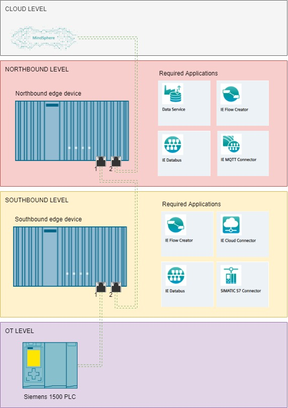

### Setup

- Cloud
  - Connected to PORT 2 on edge device.

- Northbound edge device
  - Uses Port 1 for Southbound connection
  - Uses Port 2 for cloud connection
  - Applications
    - Dataservice - Saves data from southbound device in database      
    - Flow creator - Checks if data is flowing - for debugging      
    - IE Databus - Is used as data channel - MQTT broker      
    - IE MQTT Connector - Connects to the IE Cloud Connector of southbound device
      

- Southbound edge device
  - Uses Port 1 For Northbound connection
  - Uses Port 2 for OT level Connection
  - Applications    
    - IE Cloud Connector - Sends incoming data to another channel for northbound device to listen to    
    - Simatic s7 Connector - Connects to the PLC and publishes data over the databus
    - IE Databus  - Is used as data channel - MQTT broker      
    - Flow Creator - Checks if data is flowing - for debugging
      
- OT Level PLC
  - [Uses Tia Tank sample application](https://github.com/industrial-edge/miscellaneous#tank-application)

# Get started

## Networks
  - OT-South network 192.168.0.x/24 range
  - South-North network 192.168.1.x/24 range
  - North-Cloud network 192.168.2.x/24 range
  - Devices:
    - PLC: 
      - 192.168.0.10
    - South Device: 
      - port 1: 192.168.0.11
      - port 2: 192.168.1.10
    - North Device:
      - port 1: 192.168.1.11
      - port 2: 192.168.2.10 

## OT - Level
  Run Tia tank project on PLC SIM Advanced, or use a real PLC - Use a 1500 plc [Link Tia Portal Project](https://github.com/industrial-edge/miscellaneous#tank-application)  Or use your own project.  
  Give this PLC ip adress in range of the OT-South network, for example 192.168.0.10

## Southbound - Level
Install the required apps
- IE Cloud Connector 
- Simatic s7 Connector 
- IE Databus 
- Flow Creator 

Setup the network settings
  - Give the Southbound-Device Port 2 ip adress in range of the OT-South network, for example 192.168.0.11
  - Give the Southbound-Device Port 1 ip adress in range of the South-North network, for example 192.168.1.10

### Southbound - Simatic s7 Connector
1. Open the Industrial Edge Management - Go to Data Connections - Select the Simatic S7 connector
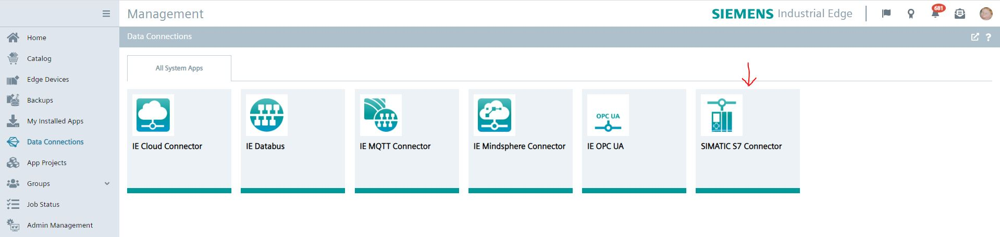
2. Launch on the Southbound device - select S7 or OPCUA (we use opcua) - add data Source 
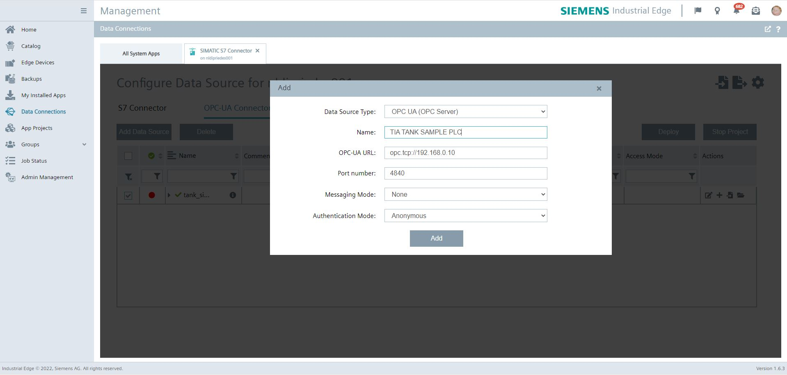
3. Fill in the ip adress and port 192.168.0.10 port 4840 and save
4. Set the settings - use username: edge and password: edge, then press save.
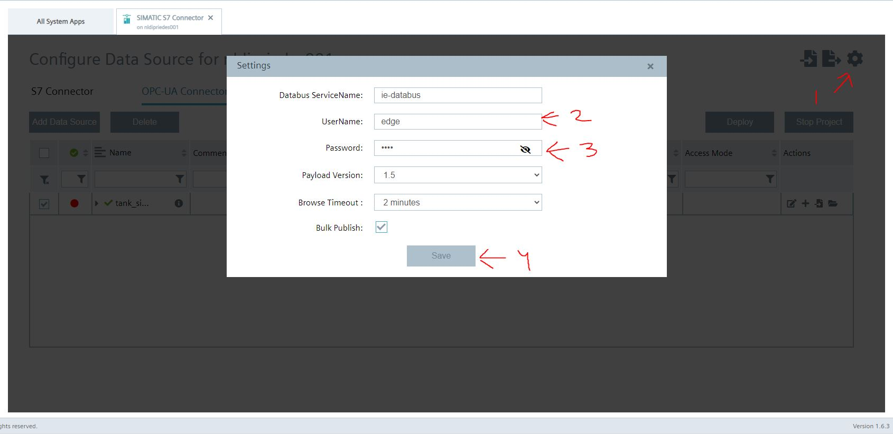
5. A new row should be available in the list, press browse tags, all the tags should be read from the datasource. add them all.
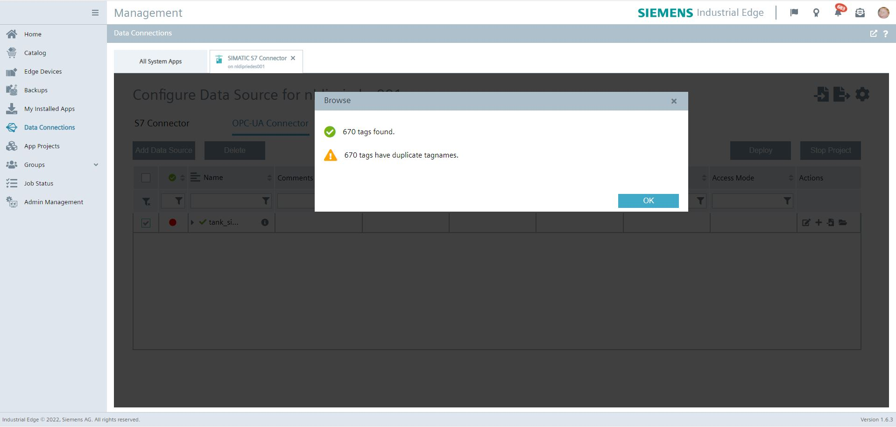
6. Deploy and start project, wait until done.

### Southbound - IE Databus
1. Open the Industrial Edge Management - Go to Data Connections - Select the IE Databus
2. Launch on the Southbound device 
3. Add user + 
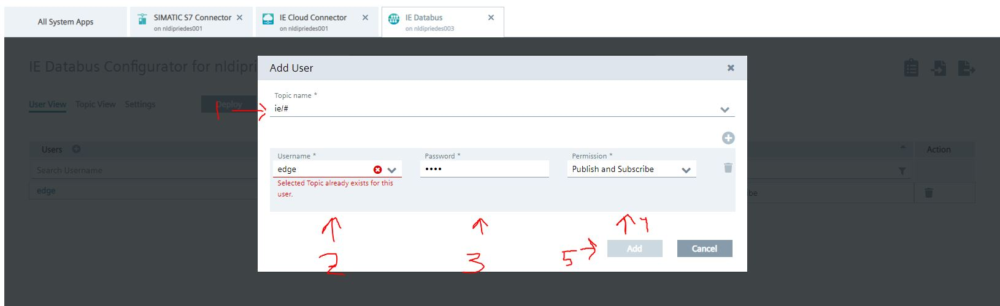
4. Topic: ie/#, username: edge, password: edge, permission: publish and subscribe, click on add.
5. Deploy, wait until its done

### Southbound - Flow Creator
1. open flow creator - on edge device, login with edge credentials 
2. add mqtt in node
3. add server: 
    - server: ie-databus
    - port: 1883
    - security - user: edge
    - security - password: edge
    - click on save
    - 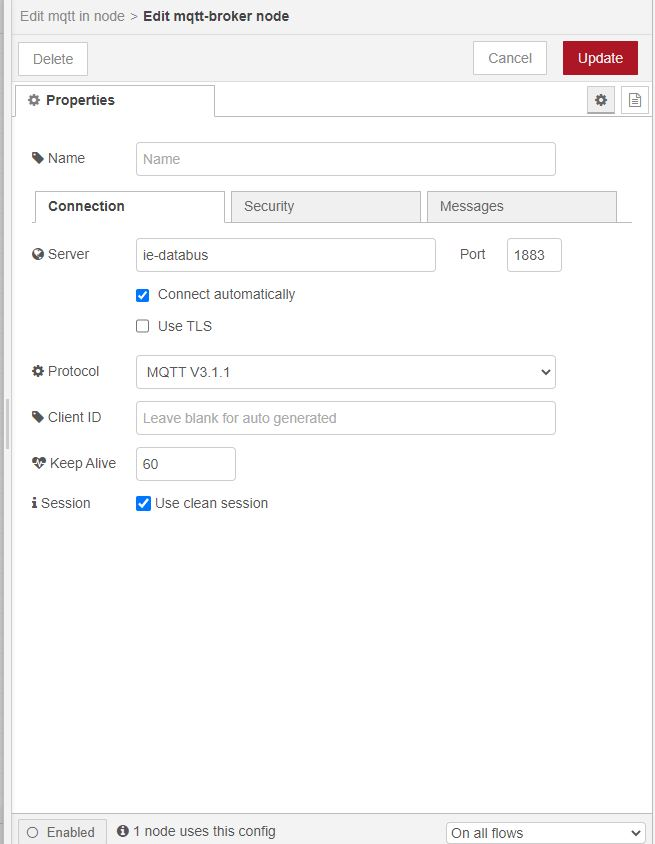
4. set topic:
    - ie/#
    - click on done.
5. add message node and connect, then deploy.
6. check if data is flowing in debug window.

### Southbound - IE Cloud Connector
F.Y.I. - It might be better to setup the northbound device - IE MQTT Connector - first

1. Open the Industrial Edge Management - Go to Data Connections - Select IE Cloud Connector
2. we are going to add 2 topics, one for the metadata. and one for the regular data.
   - First add the topic for the metadata: ie/m/j/simatic/v1/s7c1/dp then save
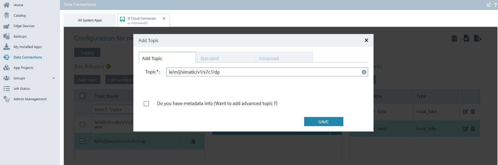
   - Then were going to add the topic for the data: ie/d/j/simatic/v1/s7c1/dp/r/tia_tank_sample_plc/default (The 'tia_tank_sample_plc' is the name of your device in the c7 connector)
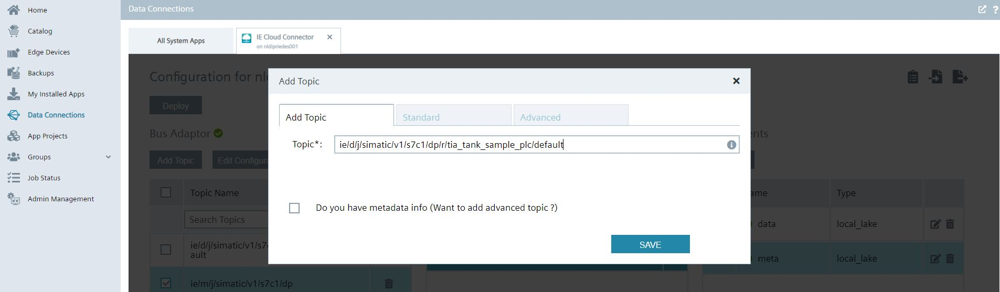
2. Then we add 2 routes, one for each type of topic:
   - data
   - meta
3. Then we add a cloud client, one is data
  - click Add client Name is Data, Type is LOCAL_LAKE
  - click on edit
    - Host: 192.168.1.11 (North device port 1)
    - Port: 9883 (IE MQTT Connector port)
    - Name: edge
    - Password: edge
    - Advanced tab
      - Topic for public: ie/d/j/simatic/v1/ied1:s7c1/dp/r/tia_tank_sample_plc/default (we added 'ied1:' in the path)
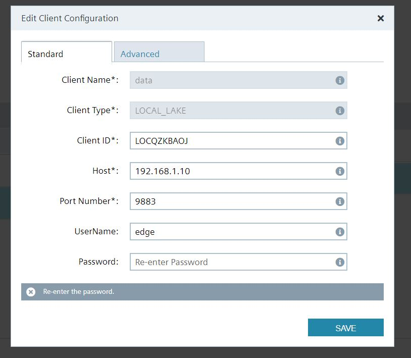
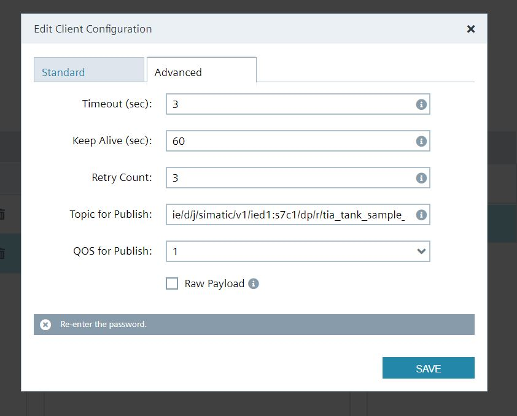
3. Then we add a cloud client, the other one is meta
  - click Add client Name is Data, Type is LOCAL_LAKE
  - click on edit
    - Host: 192.168.1.11 (North device port 1)
    - Port: 9883 (IE MQTT Connector port)
    - Name: edge
    - Password: edge
    - Advanced tab
      - Topic for public: ie/d/j/simatic/v1/ied1:s7c1/dp/ (we added 'ied1:' in the path)
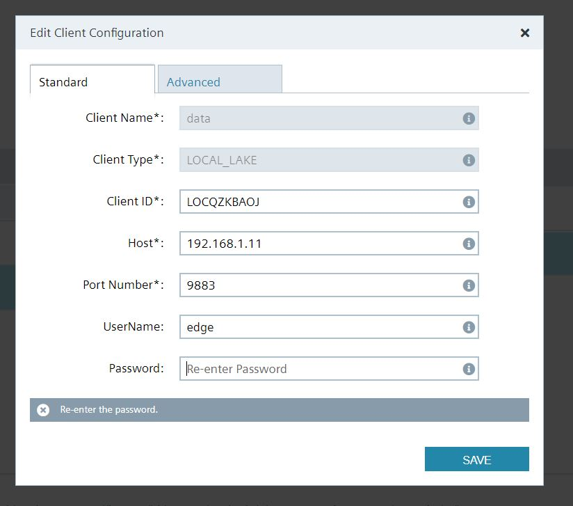
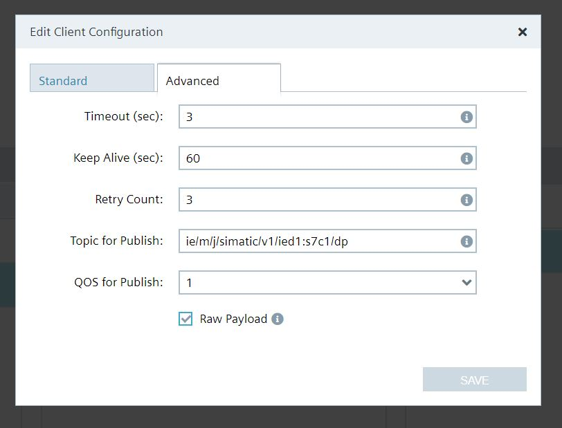
5. Then we connect the data  row
  - press on the route 'data', it wil become blue
  - check the checkbox on topic: ie/d/j/simatic/v1/s7c1/dp/r/tia_tank_sample_plc/default
  - check the checkbox on client: data
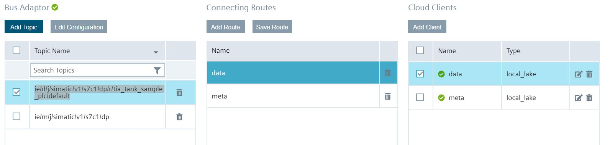
5. Then we connect the meta  row
  - press on the route 'meta', it wil become blue
  - check the checkbox on topic: ie/d/j/simatic/v1/s7c1/dp
  - check the checkbox on client: meta
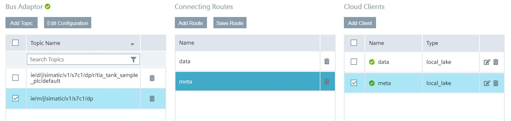
6. Click on deploy.

## Northbound - Level
Install the required apps
- Dataservice 
- IE MQTT Connector 
- IE Databus
- Flow Creator 

Setup the network settings
  - Give the Northbound-Device Port 2 ip adress in range of the OT-South network, for example 192.168.2.10 
  - Give the Northbound-Device Port 1 ip adress in range of the South-North network, for example 192.168.1.11

### Northbound - IE Databus
1. Open the Industrial Edge Management - Go to Data Connections - Select the IE Databus
2. Launch on the Northbound device 
3. Add user + 

4. Topic: ie/#, username: edge, password: edge, permission: publish and subscribe, click on add..
5. Deploy, wait until its done

### Northbound - IE MQTT Connector 
1. Open the Industrial Edge Management - Go to Data Connections - Select the IE MQTT Connector
2. Launch on the Northbound device 
3. Add user +
   - user: edge
   - password: edge
   - save
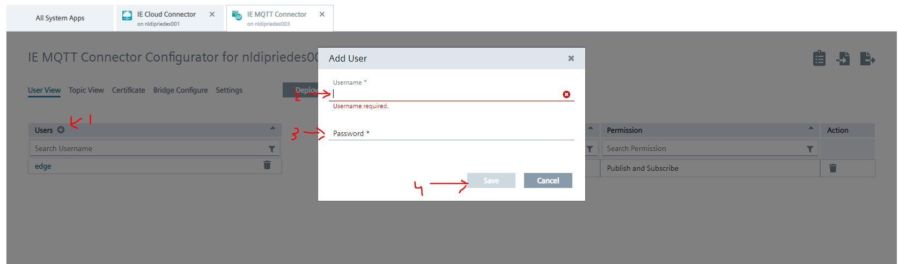
4. Topic add + 
   - add: ie/#
   - permission: piblish and subscribe
   - click add
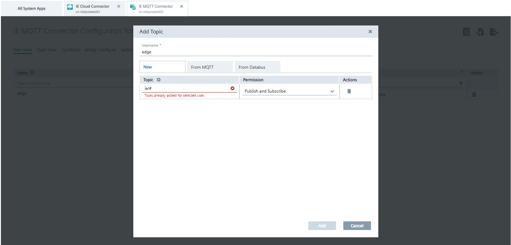
5. Set security unsecure
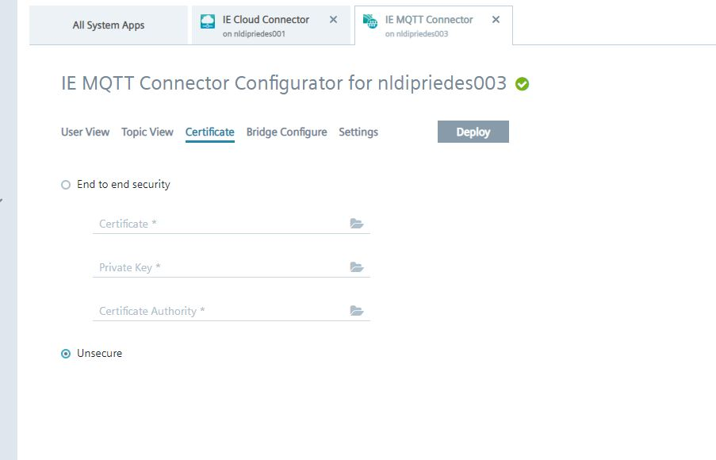
6. Set the Bridge configuration
   - set enable custom bridge
   - Set username and password as edge ; edge
   - click on connect
   - click on add row
   - set topic: ie/#
   - direction: IE MQTT Connector -> IE Databus
   - QOS 2
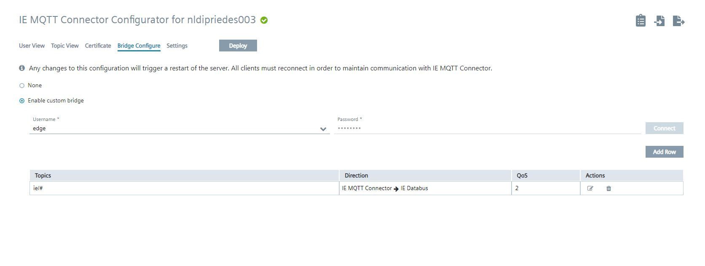
7. Click on Deploy

### Northbound - Flow Creator
1. open flow creator - on edge device, login with edge credentials 
2. Add mqtt in node
3. Add server: 
    - server: ie-databus
    - port: 1883
    - security - user: edge
    - security - password: edge
    - click on save
    - 
4. Set topic:
    - ie/#
    - click on done.
5. Add message node and connect, then deploy.
6. Check if data is flowing in debug window from the other edge device, then the bridge is setup.

### Northbound - Dataservice 
1. Open flow creator - on edge device.
2. Go to adapter and add adapter
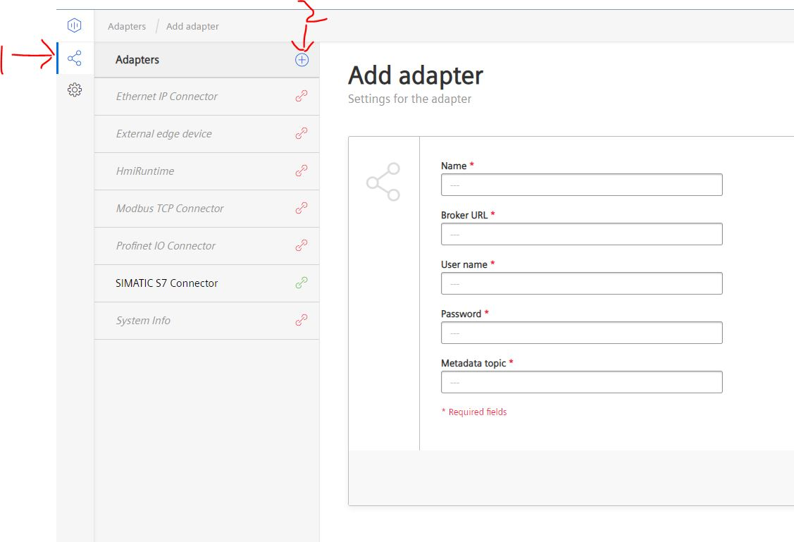
3. Fill in fields:
   - name: southbound_Device
   - url: tcp://ie-databus:1883
   - name: edge
   - password: edge
   - metadata: ie/d/j/simatic/v1/ied1:s7c1/dp/
   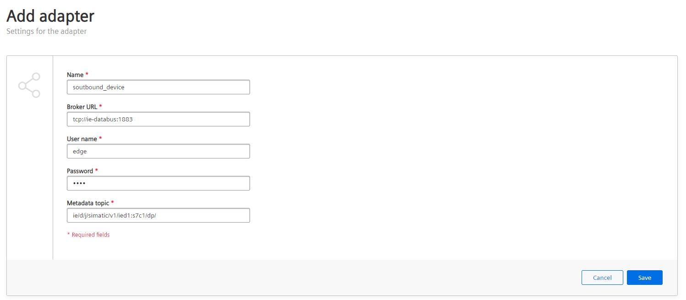
4. Click save
5. and enable the new adapter, check if it is connected.
