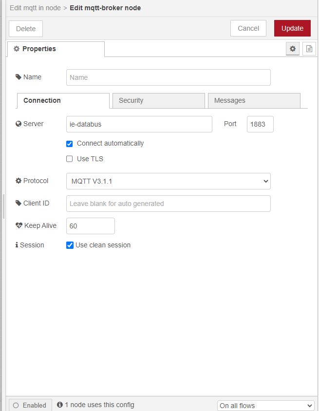

# Northbound southbound edge devices
Connecting edge devices to connect to a cloud service or do centralized dashboarding.
[Official documentation](https://github.com/industrial-edge/Shopfloor-to-Cloud-Connectivity#network-architecture)

## Overview

### Setup

- Cloud
  - Connected to PORT 2 on edge device.

- Northbound edge device
  - Uses Port 1 for Southbound connection
  - Uses Port 2 for cloud connection
  - Applications
    - Dataservice - Saves data from southbound device in database      
    - Flow creator - Checks if data is flowing - for debugging      
    - IE Databus - Is used as data channel - MQTT broker      
    - IE MQTT Connector - Connects to the IE Cloud Connector of southbound device
      

- Southbound edge device
  - Uses Port 1 For Northbound connection
  - Uses Port 2 for OT level Connection
  - Applications    
    - IE Cloud Connector - Sends incoming data to another channel for northbound device to listen to    
    - Simatic s7 Connector - Connects to the PLC and publishes data over the databus
    - IE Databus  - Is used as data channel - MQTT broker      
    - Flow Creator - Checks if data is flowing - for debugging
      
- OT Level PLC
  - [Uses Tia Tank sample application](https://github.com/industrial-edge/miscellaneous#tank-application)

# Get started

## Networks
  - OT-South network 192.168.0.x/24 range
  - South-North network 192.168.1.x/24 range
  - North-Cloud network 192.168.2.x/24 range

## OT - Level
  Run Tia tank project on PLC SIM Advanced, or use a real PLC - Use a 1500 plc [Link Tia Portal Project](https://github.com/industrial-edge/miscellaneous#tank-application)  Or use your own project.  
  Give this PLC ip adress in range of the OT-South network, for example 192.168.0.10

## Southbound - Level
Install the required apps
- IE Cloud Connector 
- Simatic s7 Connector 
- IE Databus 
- Flow Creator 

Setup the network settings
  - Give the Southbound-Device Port 2 ip adress in range of the OT-South network, for example 192.168.0.11
  - Give the Southbound-Device Port 1 ip adress in range of the South-North network, for example 192.168.1.10

### Simatic s7 Connector
1. Open the Industrial Edge Management - Go to Data Connections - Select the Simatic S7 connector

2. Launch on the Southbound device - select S7 or OPCUA (we use opcua) - add data Source 

3. Fill in the ip adress and port 192.168.0.10 port 4840 and save
4. Set the settings - use username: edge and password: edge, then press save.

5. A new row should be available in the list, press browse tags, all the tags should be read from the datasource. add them all.

6. Deploy and start project, wait until done.

### IE Databus
1. Open the Industrial Edge Management - Go to Data Connections - Select the IE Databus
2. Launch on the Southbound device 
3. Add user + 

4. Topic: ie/#, username: edge, password: edge, permission: publish and subscribe, click on add.
5. Deploy, wait until its done

### Flow Creator
1. open flow creator, login with edge credentials
2. add mqtt in node
3. add server: 
    - server: ie-databus
    - port: 1883
    - security - user: edge
    - security - password: edge
    - click on save
    - 
4. set topic:
    - ie/#
    - click on done.
5. add message node and connect, then deploy.
6. check if data is flowing in debug window.

